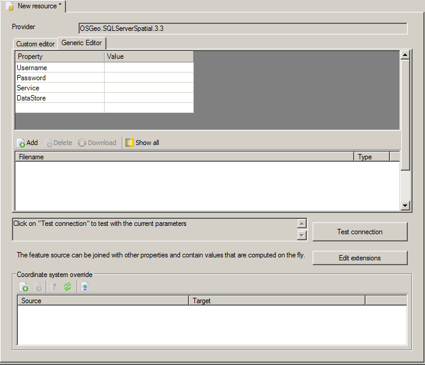

Using data from a database
--------------------------

Updating FDO providers
======================

When you install MapGuide, it only has a subset of the avalible FDO providers. This will hopefully be fixed in the future, but for now you can manually upgrade you FDO provider collection.

Creating a feature source
=========================

To create a feature source, simply click on the "Add" button, and select "Dataconnection". You should new see the following dialog:

.. image:: images/ProviderSelection.png

Choosing a provider
===================

If you are missing a provider for your special data type, make sure you have upgraded your FDO providers.

You may be tempted to use the ODBC provider because you already have an ODBC connection to your database. The ODBC provider works, but DOES NOT allow you to use spatial data, only the non-spatial data can be read from an ODBC connection. This argument gets a bit fuzzy because ODBC can actually treat X and Y columns as if the were a feature. But in short, do not use and ODBC connection to an Oracle, PostGIS, MsSQL Spatial or MySql database.

Once the ODBC provider is out of the picture, it is usually pretty clear what provider you want to use.

When you have created a new Feature Source, your screen looks like this:

.. images/dbmsProvider.png

I chose the PostGIS provider, if you chose another provider, it may look a bit different.

If the provider does not work, you can also try the OGR provider. It supports a large number of database, such as PostGIS, Oracle, MySql? and SQLite.

The main items on the page should be fairly self explanatory, except perhaps the credentials.

Credentials
===========

When using a database system, you may have to provide credentials before you can access the database. In MapGuide Maestro, you can choose to use the same credentials as the current user has. This may lead to unexpected results, especially if the user is logged in as "Anonymous". In most cases you will want to specify the credentials explicitly, if the server is not setup to accept the server IP as an authentication token.

The generic editor
==================

If the editor shown by MapGuide Maestro does not do what you want, you can use the "Generic" editor. Simply click on the "Generic Editor" tab. The generic editor shows you the raw data that is being passed to the provider. In the generic editor, you can both view and modify the values as you please.

You must seek information on what the values should be, if it is not obvious.

In some rare cases, you may also want to modify files attached to a datasource. If you click the "Show All" button, you may see some previously hidden files. If you are really looking for adventure, you can click the "Edit as Xml..." button on the top to see and edit the underlying Xml. If you click OK, the display will reflect your changes to the Xml.

Extensions
==========

If you have data in multiple sources, you can Join datasources with extensions?.

Coordinate System Overrides
===========================

If your data does not contain coordinate system information, see Using Coordinate system overrides?.