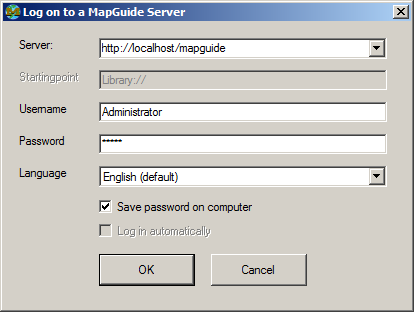
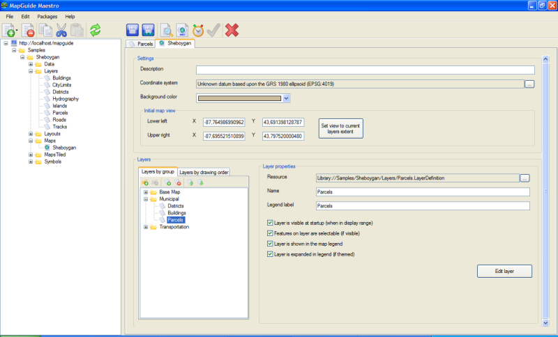

Navigating in MapGuide Maestro
------------------------------

When you start MapGuide Maestro for the first time, you will meet the login screen:

In the server name field, you must enter the url to the server.
If you use the default installation bundled with Apache, you must use the following URL:
`http://localhost:8080/mapguide/`

If you use an IIS based installation, or a regular Apache server, you must use the following URL:
`http://localhost/mapguide/`

If your MapGuide server is running on another machine than MapGuide Maestro, you must substitute "localhost" with the name of the server, eg. www.example.com.

If MapGuide runs with the default setup, the username is "Administrator" and the password is "admin".
If the server is publicly avalible, please advise the server administrator to change it! 
If the username or password is changed, contact the server administrator for the new information.
The "Language" should be detected automatically based on your machine configuration. You may change the language if you prefer. If your prefered language is not listed, you can help yourself and other by translating MapGuide Maestro. It takes about 30 to 60 minutes to translate all the files.

The user interface
==================

The MapGuide Maestro user interface is built like other applications, where all items are listed in a tree like structure on the left, and a detailed editing area on the right:

MapGuide Maestro has a toolbar with buttons above the tree and another one above the edit area. Those buttons perform actions on the items below. The menus provide access to the same functions, as well as some less frequently used functions.

Getting some data
=================

If you are just starting out with MapGuide, you will benefit from having som example data to look at and modify. You can download the "Sheboygan.mgp" sample from the MapGuide site. Note: A package is similar to a backup, and you do not need a package to create your own site.

To load a package from MapGuide Maestro, choose the menu "Packages" and the select "Restore package...". Now browse to the package you downloaded, then click "OK" and wait for the process to complete.

Feel free to open any item in the list to see how it looks. Also note the folder structure used. You should structure your own data in folders so you can manage it more easily later. If you break something, you can just load the package again.