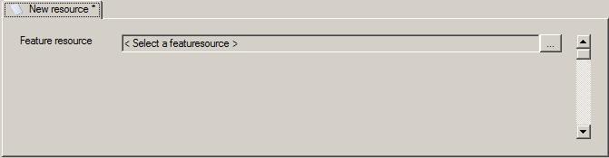
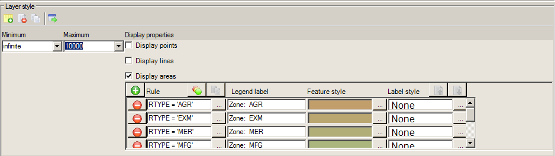

Styling and Theming Vector Data
-------------------------------

Creating a new layer
====================

To create a new layer, simply click on the "Add" button and select "Layer".

You should new see the following dialog:

Now browse to an existing FeatureSource. Since this page is about vector data, make sure you don't select a raster layer. Once you have selected a FeatureSource, your display should look like this:

.. image:: images/LayerStartup.png

Resource Settings
=================

In the section of the layer editor titled "Resource Settings", you can select the basic properties of the layer. The "Schema" is the list of avalible tables or files from the FeatureSource. File based data usually only has one entry here.

The "Geometry" entry is the column where geometric data is stored. For ODBC this may be a fictional column that hides a pair of X,Y columns. Most data sources have only one entry per table.

If this layer should only display some of the data in the table, you can insert a "Filter". A filter is an SQL expression in FDO format. To use this field, you must have some knowledge of the SQL language. A description of SQL is outside of the scope of this guide, but the w3schools intro may help you out. Once you get a grasp of SQL, the "Filter" is actually the "WHERE" clause in an SQL statement.

For this simple guide, you can try something like::

 ID > 100

This will hide all items where the value of the ID column is less than 100. If you click the "..." button at the end, you will see an incomplete editor that basically gives you a bigger text area to type in.

A feature in MapGuide can also have a link. If the user pauses the mouse over a feature with a link, they will recieve a message that indicates they can open the link. If you type in a string like::
 
 'http://osgeo.mapguide.org/'

all features will point to the same page. If you type in the name of a column, then that columns value will be used as the link. You can build more complex links by using the + operator::
 
 "URL" + '?ID=' + "ID"
 
If a feature has the values: URL = "http://osgeo.mapguide.org" and ID = "7", the link becomes "http://osgeo.mapguide.org?ID=7". A slightly more robust but less obvious way is to use the "concat" function::
 
 CONCAT(CONCAT("URL", '?ID='), "ID")
 
The two statements produce the same results, but the latter is required for some providers. If you click the "..." button at the end, you will see an incomplete editor that basically gives you a bigger text area to type in.

The "Tooltip" field is subject to the same rules as the "Link" field, but will result in a tooltip the user can see. You may build a html fragment rather than a simple string. Such a html fragment can include an image like this::
 
 '<b>Preview:</b> '
 
Once again, these examples require knowledge of both html and SQL. Further information about these enormous topics can be found in books or by searching the internet.

Properties avalible in the viewer
=================================

If it is possible to select features in your map (you may not be decided on this point yet), it is also possible that you want to display some of the data that is associated with the feature. This section of the editor lets you choose what columns are avalible, as well as the title of the column should be for the user. You can safely skip this section and move on if you don't know what to do with it.

Layer style
===========

This section is where you actually decide how your data should be displayed. Maps are special because they show many informations at the same time. A typical map will start out with some form of overview of the area, and then as the user zooms in, the map becomes more and more detailed. If one tries to display all buildings in an overview of USA, it will most likely not make a usefull map. For this reason a layer has scale ranges.

A scale range defines what the layer should look like at a certain zoom level. A common use of scale ranges is to hide a layer, eg. buildings, until the user has zoomed far enough in. Another use would be to adjust the line thickness to make it more or less intrusive at certain intervals. If the layer should be visible and look the same all the time, the interval would be set like this: min = 0 to max = infinite.

The core layer editor looks like this:

The three buttons at the top can be used to add a new blank scale range, delete a scale range, and insert a copy of the currently selected scale range. The fourth last button can be used to make the editor fill the entire screen.

Inside each scale range, it is possible to select apperance information for each of the three basic geometry types: points, lines and polygons. The checkbox enables you to completely hide a specific geometry type, which is usefull if your data does not contain any geometries of a specific type. If none of the boxes are checked, no geometries will be visible in the given scale range.

For each of the basic geometries, there must be at least one rule. Each rule can be assigned an expression that explains what features the rule applies to. If you create a rule with the expression "PropertyValue? > 10000000" and a rule with no expression, all objects that have a propertyvalue greater than 10 million, will look like the style for the first rule dictates, and all others will look as the second rule dictates. If you remove the second rule, only items matching the first rule will be displayed. If a feature matches multiple rules, the first rule is applied.

A common use of rules, is to create a theme, where objects are color coded according to a value, eg. parcels color code by property value.

The "Theme" button is not created yet, but once done, it will be able to create gradient color set. If you want to help out, you can implement such a dialog and submit it to the Maestro project.

The label field allows you to enter a label that is displayed for the features. You can enter expressions format labels, using data from the feature.

The label style field can be used to change properties for the label, such as font, color and size. Double click the field, or click the browse button to bring up the label style editor.

The object style field is where you choose how the feature is displayed on the map. Double click the field or click the browse button to bring up feature editor. The editor is looks a little different for the point, line and area styles, but all contains properties such as color, line width, fill style.