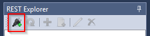
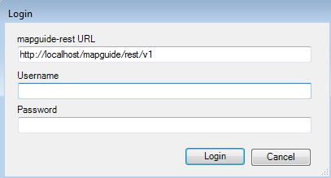
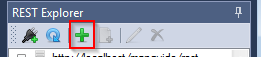
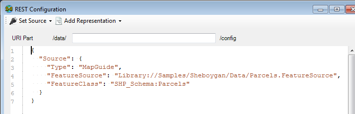
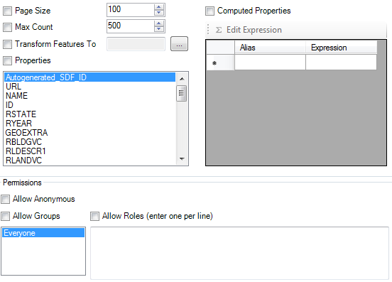
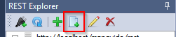

# The REST Explorer

The **REST Explorer** is an optional addin for connecting to and working with [mapguide-rest](https://github.com/jumpinjackie/mapguide-rest) configurations

## About configurations

A mapguide-rest configuration is a JSON document that defines how a particular Feature Source or Layer Definition is exposed in a RESTful manner via mapguide-rest.

Feature data in a Feature Source or Layer Definition configured for RESTful access can be accessed through a standard HTTP client with standard verbs (`GET`, `POST`, `PUT`, `DELETE`) and established conventions for each particular verb.

The **REST Explorer** provides a specialized user interface for browsing, creating and editing mapguide-rest configurations.

You can read more about mapguide-rest configurations from the [mapguide-rest wiki](https://github.com/jumpinjackie/mapguide-rest/wiki/Data-configuration)

## Connecting to a mapguide-rest instance

To connect to a mapguide-rest instance, click the connect button on the **REST Explorer** toolbar

This will open a login dialog for you to enter the endpoint and credentials. Use the same Administrator/Author credentials as you would for a normal MapGuide Site connection.

Once connected, the **REST Explorer** will enumerate all known configurations

Expanding a configuration node will list any associated template files for that configuration

## Creating a new configuration

To create a new mapguide-rest configuration, establish a mapguide-rest connection and click the add button.

This will open the **REST Configuration** dialog where you can proceed to edit the configuration.

### 1. Set the URI part

Enter the URI part in the provided text box.

The basically defines the RESTful endpoint where this resource is accessible from. For example, assuming mapguide-rest is available at `http://localhost/mapguide/rest`, a URI part of `parcels` means the RESTful endpoint for this resource is available at:

`http://localhost/mapguide/rest/data/parcels`

The various representations you can configure for this resource hang off of this base URL endpoint. For example, if you configured an XML representation, you can access XML feature data for your resource by doing a `GET` request to:

`http://localhost/mapguide/rest/data/parcels/.xml`

### 2. Set a source

Choose either a **Feature Source** or **Layer Definition**, 

Either option will present a resource picker where you can select the Feature Source or Layer Definition to use.

Once selected, the source JSON fragment will be added to the document

### 3. Add one or more representations

Once you've set a source, you need to add one or more representations via the **Add Representation** menu.

The following representations are available:

 * XML - Feature data in this source can be accessed as XML
 * GeoJSON - Feature data in this source can be accessed as GeoJSON
 * CSV - Feature data in this source can be accessed as CSV (Comma-Separated Values)
 * Image - Feature data in this source can be rendered out as a map image
 * Template - Feature data in this source can be rendered out through user-defined textual templates

Depending on the representation you chose you will get a new dialog that lets you configure each supported verb of the selected representation.

Each method is detailed below

#### Representation Details - GET

The `GET` representation UI lets to you define the behavior of how responses are returned when an application makes a `GET` request to this RESTful endpoint

The main options mainly revolve around:

 * Feature Limit and Pagination
 * Exposing what feature properties can be returned
 * The coordinate system to transform feature geometries to
 * Any additional computed properties to expose in the response
 * Permissions on what users/groups can access this RESTful endpoint via the `GET` method

#### Representation Details - POST/PUT/DELETE

The UI for specifying `POST`, `PUT` and `DELETE` all concern permissions to define which users and groups are allowed to make requests to this RESTful endpoint for the given method

The settings are the same as the **Permissions** section of the `GET` represenation configuration

## Adding template files

If you configured a RESTful endpoint with a template representation, you will need to upload the required template files under that configuration. To do this, select the endpoint configuration node and click the button to add files.

This will present a file picker where you can select the template file to upload.

Once uploaded, the file will appear as a child node under the configuration node, and the file name can be referenced in the template representation settings