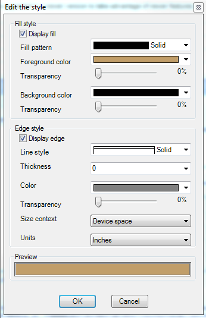

Understanding Layers
====================

There are 3 types of Layer Definitions:

 * Vector Layer Definitions
 * Drawing Layer Definitions
 * Grid (Raster) Layer Definitions
 
**Vector Layer Definitions** describe style and presentation settings for vector data coming from a Feature Source. Structurally, a Vector
Layer Definition has:

 * 1 or more Scale Ranges
 * Each Scale Range can have 1 or more point/area/line rules. Creating a theme will auto-generate a certain number of point/area/line rules based on the theming criteria.

**Drawing Layer Definitions** describe presentation settings for data coming from a Drawing Source. A Drawing Source layer simply specifies 
the DWF layers from the Drawing Source that will be displayed for this Layer Definition

**Raster Layer Definitions** describe style and presentation settings for raster data coming from a Feature Source. Structurally a Raster
Layer Definition has a single scale range, with a specified color style and optional hillshade and elevation settings.

This section describes the Layer Definition editor and its various settings.

Vector Layer Editor
-------------------

Resource Settings
^^^^^^^^^^^^^^^^^

The **Resource Settings** section of the Vector Layer editor specifies the core properties of this Vector Layer

.. figure:: images/ldf_vector_settings.png

 *Resource Settings section*

The **Feature Source** field specifies the Feature Source this Layer Definition applies to. The **Feature Class** field and **Geometry Property**
fields specifies the Geometry property that these style settings will be applied to.

All the fields under the **Layer Settings** group specify viewer interaction behaviors:

 * **Filter** specifies an FDO attribute filter that will be applied when querying data from the Feature Source for rendering
 * **Hyperlink** specifies an FDO expression that represents the URL that will be launched when the user CTRL+clicks on a feature in this layer
 * **Tooltip** specifics an FDO expression that represents the HTML content that is displayed in a tooltip when the user hovers over any feature on this layer with the mouse pointer.

Layer Properties Visible in Viewer
^^^^^^^^^^^^^^^^^^^^^^^^^^^^^^^^^^

The **Layer Properties Visible in Viewer** section of the editor specifies what properties of this layer are visible in the **Properties Pane** of the AJAX or Fusion viewer when a feature
from this layer is selected.

.. figure:: images/ldf_vector_property_mappings.png

 *Layer Properties Visible in Viewer*

Simply tick the desired properties to make them visible. You can edit cells in the **Display Name** column to change the label for each property.

Layer Styles
^^^^^^^^^^^^

The **Layer Styles** section is the meat and potatoes of this editor. 

.. figure:: images/ldf_vector_scale_range.png

 *Layer Styles*
 
The above screenshot shows an editor for one particular scale range (0 to 10000). Clicking **Add** on the toolbar will add another control
for a new scale range. Each scale range has:

 * 0 or more point styles. Un-ticking **Display points** will detach all currently specified point styles.
 * 0 or more line styles. Un-ticking **Display lines** will detach all currently specified line styles.
 * 0 or more area (polygon) styles. Un-ticking **Display areas** will detach all currently specified area styles.

Each point/line/area style is represented by a control like the one below

.. figure:: images/ldf_vector_rule_control.png

 *A style rule control*
 
These controls will allow you to edit (from left to right):

 * The FDO filter that a feature must satisfy for this rule to be applied (default is empty = all features). Clicking the button will launch the FDO Expression Editor.
 * The legend label for this rule
 * The style preview for this rule. Clicking the button will launch the respective point/line/area style editor.
 * The feature label. Clicking the button will launch the FDO Expression Editor.
 
Rules can be added by clicking the add button on the top toolbar (indicated by a green plus icon).

A theme can be generated by clicking on the theme button on the top toolbar (indicated by 3 overlapping circles of different colors). See :ref:`ldf-theming-layers` for more information.

Rules can be removed by clicking the remove button for the associated rule style control (indicated by a red minus icon)

.. _ldf-theming-layers:

Theming Layers
^^^^^^^^^^^^^^

Clicking the theme button will display the following dialog

.. figure:: images/ldf_vector_theme_generator.png

 *The theme creator dialog*
 
This dialog provides all the options for generating a theme, which can be based on:

 * All values of a specific property
 * All ranges/distributions of a specific property

Each generated rule wil use a color from a specified color ramp. The color ramp can be gradient-based or use
ColorBrewer thematics.

An option is also available that allows you to use the first rule of your current style as the "prototype" from which your theme rules will be created
from, avoiding the need to manually re-style each individual theme rule after generation.

Once you have specified the theme settings and clicked **OK**, the matching rules will be generated and will replace
or be appended to your existing set of style rules for this scale range.

Point Style Rules
^^^^^^^^^^^^^^^^^

Clicking the **...** button beside the previewed point style on the rule editor control will display the Point Style Dialog

.. figure:: images/ldf_vector_point_rule.png

 *The Point Style dialog*
 
.. figure:: images/ldf_vector_point_rule_pt2.png

 *The Point Style dialog (fill/border settings)*
 
There are many options here, but this guide will only cover the main ones.

Point features can be drawn as symbols or as text labels. The **Display Points** checkbox governs this behavior. Ticking it will
cause these points to be drawn as symbols. Un-ticking it will cause these points to be drawn as text. The symbol size and rotation
parameters can either be numbers or numerical FDO expressions.

For point symbology, you can choose a pre-defined list of symbols under the **Symbol** dropdown. The very last option 
in that dropdown (`Symbol`) allows you to pick a custom symbol from an existing **Symbol Library** resource.

Note that the generated preview at the bottom of the dialog is an approximation and does not exactly reflect the style settings you have defined. This preview would
be the same image if you were to look at this layer's icon in the AJAX or Fusion viewer legend.

If you want an exact representation, use the **Preview** command in the main toolbar to view this Layer in your system default web browser. Here
you can better verify your point style settings are correct.

Line Style Rules
^^^^^^^^^^^^^^^^

Clicking the **...** button beside the previewed line style on the rule editor control will display the Line Style Dialog

.. figure:: images/ldf_vector_line_rule.png

 *The Line Style Dialog*

Just like point rules, line rules need not actually display lines. Line rules can display text. If so, the text labels will
be rendered along the line geometry of each matching feature, but the line itself will not be rendered. The **Apply line style**
checkbox governs whether the lines will be rendered. 

You can specify color, thickness and line pattern for the line style. Size context and units govern how the thickness
parameter is to be interpreted when rendering.

Line styles can be single or composite. The **Use composite lines** checkbox determines whether the line style will be single or composite. 

.. figure:: images/ldf_vector_line_rule_composite.png

 *The Line Style Dialog with composite settings enabled*
 
Composite line styles consists of multiple line patterns stacked on top of each other to form a composite line style. Line 
geometries of each matching feature will be rendered with this line style. To add or remove lines from the composite line style,
use the **Add** and **Remove** buttons on the Composite Line toolbar.

Area Style Rules
^^^^^^^^^^^^^^^^

Clicking the **...** button beside the previewed area style on the rule editor control will display the Area Style Dialog

 *The Area Style Dialog*
 
This dialog allows you to control the two main aspects of an area style:

 * The fill display
 * The edge/border display
 
Once again, the preview at the bottom of the dialog reflects your current style settings. 

Composite Style Rules
^^^^^^^^^^^^^^^^^^^^^

Clicking the **...** button beside the previewed area style on the rule editor control will display the Symbol Instances Dialog

.. figure:: images/ldf_vector_composite_rule.png

 *A Composite Style Rule control*

This dialog allows you to include references to existing Symbol Defintions or define such Symbol Definitions inline.

.. figure:: images/ldf_symbol_instances_dialog.png

 *The Symbol Instances Dialog*

For each symbol definition you include (referenced or inline), you can provide override any parameter values that are exposed. You 
can use FDO expressions for override parameter values.

The inline symbol definitions use the same editors as the normal symbol definition editor. See :ref:`symbol_definitions`
 
.. note::

    Unlike Point/Line/Area styles, the top-level preview is blank because rendering composite symbolization preview is not currently supported. However
    the **Symbol Instances Dialog** does offer basic previewing support. What you see in the symbol preview is simply an enlarged version of the icon that
    you would see for this layer if it was displayed in the AJAX or Fusion viewer legend.

Label Settings
^^^^^^^^^^^^^^

Clicking the **...** button beside the label preview on the rule editor control will display the Label Settings Dialog

.. figure:: images/ldf_vector_label.png

 *The Label Settings Dialog*
 
This dialog allows you to control the labelling of line/area/point styles. Label text can be hard-coded strings or more commonly: derived
from an FDO expression or a Feature Class Property.

Drawing Layer Editor
--------------------

Just like the Drawing Source editor, the Drawing Layer editor is pretty simple and straight forward.

.. figure:: images/ldf_drawing_settings.png

 *The Drawing Layer Editor*
 
All you need to specify are:

 * The Drawing Source this layer will read from.
 * The DWF sheet this layer will read from.
 * The DWF layers this layer will read from.
 * The min/max scale that this Drawing Layer will be visible at.

Raster Layer Editor
-------------------

Raster Layer Settings
^^^^^^^^^^^^^^^^^^^^^

The Raster Layer editor defines style settings for raster data coming from a Feature Source.

.. figure:: images/ldf_raster_settings.png

 *Raster Layer Settings*
 
Just like the Vector Layer editor, the Raster Layer editor requires a reference to a **Feature Source** and
the **Geometry Property** (Raster Property) of a **Feature Class** so it knows where to source its raster 
data from.
 
Raster Layer Visibility
^^^^^^^^^^^^^^^^^^^^^^^ 

The Raster Layer Visibility settings govern what scale this Raster Layer is visible at.  
 
.. figure:: images/ldf_raster_visibility.png

 *Raster Layer Visibility*
 
You can also define bitonal image color settings and the zoom factor which the raster is rebuilt.

Advanced Raster Settings
^^^^^^^^^^^^^^^^^^^^^^^^
 
The Advanced Raster Settings allows you to enable settings for raster formats that support such settings.
 
.. figure:: images/ldf_raster_advanced.png

 *Advanced Raster Layer Settings*