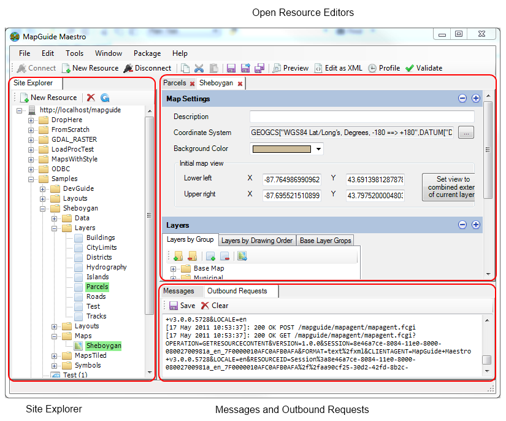

.. _user-interface:

The Maestro User Interface
==========================

The main Maestro application window is composed of the following main components:

Legend
    
    1. The Site Explorer
    2. Open Resource Editors
    3. Messages, Outbound Requests and IronPython Console
    4. Resource ID bar

The **Site Explorer** presents the visual view of your MapGuide Server **Site Repository**, showing all the folders and resources stored within. 
When you double click a resource in the Site Explorer, it will open the matching editor for that particular resource. If the resource is not known to Maestro or the
version of the resource is not known to Maestro the XML Editor will be shown instead loaded with the XML content of the selected resource. When you right click a 
resource in the Site Explorer a whole assortment of options on the context menu is available for that selected resource.

All **Open Resources** will be shown in the main area of the Maestro application window.

Maestro is designed to be as transparent as possible to the user, as such it logs a lot of messages useful for diagnostic purposes. Maestro also logs most communication
that it makes to the MapGuide Server. You can see these logged messages and requests in the **Messages and Outbound Requests** tabs.

The **IronPython Console** provides the user with an interactive REPL console, by which the user can run and evaluate snippets of IronPython code. The full Maestro API is
exposed to the console, allowing the user to script and automate the application through IronPython code. IronPython is a dialect of Python geared towards integration with
the .net Framework. For more information about this feature, see :ref:`scripting-and-automating-maestro`. For more information about IronPython, see `IronPython.net <http://ironpython.net/>`_

.. note::

    The IronPython Console feature is only available on Windows and is only bundled with the Windows installer package of Maestro

The **Resource ID bar** functions like an address bar in a web browser. Entering a Resource ID in the **Resource ID bar** and clicking `Go` will allow you to directly open
the specified resource for editing. Similarly, selecting an open editor tab will show you the Resource ID of the resource being edited. This is a feature that power users
will appreciate, as it allows for quick resource access without the need to navigate the repository in the **Site Explorer** to find it.